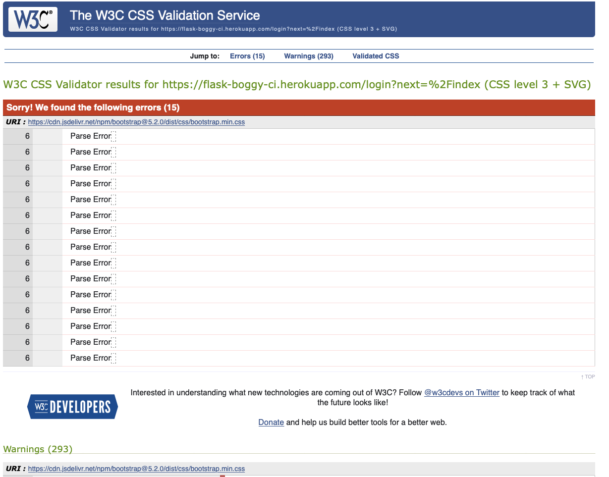
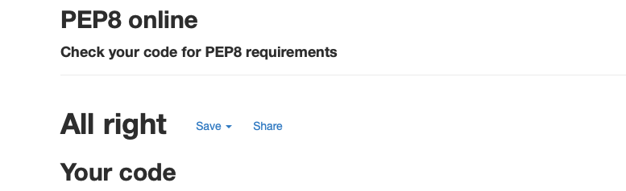
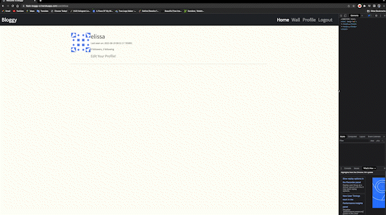

<h1 align="center">Testing</h1>

---

## Index 

- <a href="#validators">1. Code validators</a>
- <a href="#responsiveness">2. Responsiveness</a>
- <a href="#browser-compatibility">3. Browser compability</a>
- <a href="#user-stories">4. Testing user stories </a>
- <a href="#defensive-design">5. Defensive design</a>
- <a href="#bugs">5. Bugs</a>

---

## 1. Code validators
- **[HTML Validator](https://validator.w3.org/):** No errors to show.
   - With testing the HTML code, I had some syntax issues on all pages I build with jinja and bootstrap templating.
   - I tested the HTML code deployed to heroku.
   - There is 6 erros on every page because of the bootstrap classes.

   

- **[CSS Validator](https://jigsaw.w3.org/css-validator/):** 15 error related to bootstrap.
   

- **[Python validator | PEP8](http://pep8online.com/):** No errors found

   

---

## 2. Responsiveness 
- Responsiveness of the game is tested with [Chrome DevTools](https://developers.google.com/web/tools/chrome-devtools) and [Responsive Design Checker](https://www.responsivedesignchecker.com/).
- The game is tested on the following devices: 
    - Desktop: 1024px, 1366px, 1440px, 1600px and 1680px. 
    - Mobile & Tablet: Galaxy S5, iPhone 5/SE, iPhone 6/7/8, iPhone 6/7/8 plus, iPhone x, iPad and  iPad Pro

